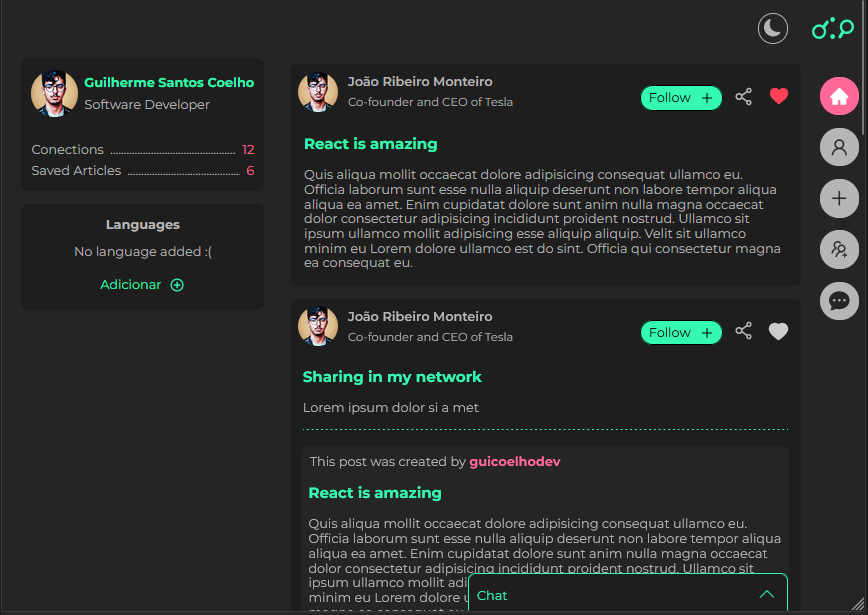

<h1 align='center'>Social Dev</h1>

<section>

</section>

 
<h3 align='center'>A modern wep app focused on being a social network focused on the technology community </h3>
 

 
 

<section>
<h2 align="center">Created by</h2>

</section>

<section style="display:flex; justify-content: center; padding-top:20px; gap:20px;">

     
    
Frontend &   Design UI/UX

    
    
Backend developer &    devOps

</section>

 

<section align='left'>

### Content

- [Preview images project](#project-images)
- [Deployed links](#deployed-links)
- [Description of project](#description)
- [Stacks used on frontend and backend app](#stacks)

  

<h2 id='project-images'>Preview project</h2>
 

<h2 id="deployed-links">Deployed links</h2>

If you wanna see our projects, check this links:

<a href="https://social-dev-sandy.vercel.app/" target="_blank">Master branch </a>

<a href="https://social-dev-git-develop-guicoelho-s.vercel.app/" target="_blank">Develop branch </a>

 

### Disclaimer

If you go to the development link it might be broken, to see the most stable version check the master link.

<h2 id="description">Description of project</h2>

This project was created in order to test and put into production the latest tools and frameworks on the market, creating a functional and usable system for users. With the intention of being a place to search for information about technology quickly and with quality, using reliable API's to provide the news.

<h2 id="stacks">Stacks used on frontend and backend app</h2>

### Frontend

- [x] React JS
- [x] Next JS
- [x] Typescript
- [x] Next Auth
- [x] Zustand
- [x] Zod
- [x] Framer motion

### Backend

- [x] Node JS
- [x] Prisma
- [x] Typescript
- [x] Multer
- [x] Firebase

 

If you want to see backend repository, <a href="https://github.com/Joao-Pedro15/API_SOCIAL_DEV" target="_blank">click here</a>

If you want to see frontend repository, <a href="https://github.com/guicoelhodev/social_dev" target="_blank">click here</a>

</section>
